# DocVision — Complete Project Documentation

> **Version:** 0.1.0 | **License:** MIT | **Python:** 3.10+

---

## Table of Contents

1. [Project Overview](#1-project-overview)
2. [High-Level Architecture](#2-high-level-architecture)
3. [Processing Modes](#3-processing-modes)
4. [Project Structure](#4-project-structure)
5. [Core Pipeline — Step by Step](#5-core-pipeline--step-by-step)
6. [Module Deep Dive](#6-module-deep-dive)
   - [6.1 Configuration (`docvision/config.py`)](#61-configuration)
   - [6.2 Data Types (`docvision/types.py`)](#62-data-types)
   - [6.3 Pipeline Orchestrator (`docvision/pipeline/orchestrator.py`)](#63-pipeline-orchestrator)
   - [6.4 Input / Output (`docvision/io/`)](#64-input--output)
   - [6.5 Preprocessing (`docvision/preprocess/`)](#65-preprocessing)
   - [6.6 Detection (`docvision/detect/`)](#66-detection)
   - [6.7 OCR Recognition (`docvision/ocr/`)](#67-ocr-recognition)
   - [6.8 Key Information Extraction (`docvision/kie/`)](#68-key-information-extraction)
   - [6.9 Azure Cloud Integration (`docvision/azure/`)](#69-azure-cloud-integration)
   - [6.10 Web UI (`docvision/web/`)](#610-web-ui)
   - [6.11 REST API (`docvision/api/`)](#611-rest-api)
   - [6.12 CLI (`docvision/cli/`)](#612-cli)
7. [Data Flow Diagrams](#7-data-flow-diagrams)
8. [ML Models Used](#8-ml-models-used)
9. [Configuration Reference](#9-configuration-reference)
10. [Output Schema](#10-output-schema)
11. [Deployment & Infrastructure](#11-deployment--infrastructure)
12. [Testing](#12-testing)
13. [Glossary](#13-glossary)

---

## 1. Project Overview

### What is DocVision?

DocVision is a **document AI system** that reads documents (PDFs, images) and extracts structured information from them — like reading a document the way a human would, but automatically.

Think of it as an extremely smart scanner that can:

- **Read text** from both printed and handwritten documents
- **Understand tables** and extract their contents into rows and columns
- **Identify key fields** (invoice numbers, dates, amounts, vendor names, etc.)
- **Validate the data** (e.g., does the total match the sum of line items?)
- **Output clean JSON** ready for your business systems

### Who is it for?

- **Businesses** processing invoices, receipts, purchase orders, delivery tickets
- **Developers** building document automation workflows
- **Data teams** extracting structured data from unstructured documents

### Key Strengths

| Feature | Description |
|---------|-------------|
| **Accuracy-First** | Uses multiple AI models and compares their answers to pick the best one |
| **Flexible** | Works fully offline (local models), fully in the cloud (Azure), or both (hybrid) |
| **Transparent** | Every extracted value shows how confident the system is and where it came from |
| **Production-Ready** | REST API, CLI, Web UI, Docker support, 449+ tests |

---

## 2. High-Level Architecture

DocVision has a layered architecture where each layer has a clear responsibility.


### How it works in plain English

1. **You upload a document** (PDF or image) through the Web UI, API, CLI, or Python code.
2. **The Orchestrator** takes the document and decides how to process it based on your chosen mode (local, azure, or hybrid).
3. **If local mode**: The document goes through 10 stages — loading, cleaning up the image, finding text regions, reading the text, understanding what the text means, and validating the results.
4. **If azure mode**: The document is sent to Azure cloud services which handle OCR and field extraction in fewer steps.
5. **If hybrid mode**: Both local and cloud pipelines run, and their results are merged to get the best accuracy.
6. **The output** is a structured JSON file with all extracted fields, tables, text, and confidence scores.

---

## 3. Processing Modes

DocVision supports three processing modes, each suited for different needs:


### Mode Comparison

| Aspect | Local | Azure | Hybrid |
|--------|-------|-------|--------|
| **Models Used** | 8 local ML models | Azure DI + GPT Vision | All of the above |
| **Internet Required** | No | Yes | Yes |
| **GPU Recommended** | Yes | No | Yes |
| **API Cost** | $0 | ~$0.01-0.05/page | ~$0.01-0.05/page |
| **Speed (single page)** | 5-15 seconds | 2-5 seconds | 10-20 seconds |
| **Accuracy** | High | High | Highest |
| **Privacy** | Data stays local | Data sent to Azure | Data sent to Azure |

---

## 4. Project Structure

```
horizon-OCR-python/
│
├── docvision/                    # 📦 Main package
│   ├── __init__.py               # Package exports
│   ├── config.py                 # Configuration management (YAML)
│   ├── types.py                  # Data models (Pydantic schemas)
│   ├── ssl_config.py             # SSL certificate configuration
│   ├── download_models.py        # Model download utilities
│   │
│   ├── pipeline/                 # 🎯 Core processing engine
│   │   └── orchestrator.py       # Main pipeline — coordinates everything
│   │
│   ├── io/                       # 📂 Input/Output handling
│   │   ├── pdf.py                # PDF loading & rasterization
│   │   ├── image.py              # Image loading & format handling
│   │   ├── artifacts.py          # Debug artifact generation
│   │   ├── reconstruction.py     # LLM-friendly reconstruction data
│   │   └── markdown.py           # Markdown report generation
│   │
│   ├── preprocess/               # 🔧 Image preprocessing
│   │   ├── enhance.py            # Denoising, CLAHE, sharpening
│   │   └── geometry.py           # Deskew, dewarp corrections
│   │
│   ├── detect/                   # 🔍 Detection models
│   │   ├── layout_doclaynet.py   # YOLO-based layout detection
│   │   ├── text_craft.py         # CRAFT text region detection
│   │   ├── table_tatr.py         # Table Transformer structure detection
│   │   ├── craft_net.py          # CRAFT neural network definition
│   │   └── craft_utils.py        # CRAFT utility functions
│   │
│   ├── ocr/                      # 📖 Text recognition (OCR)
│   │   ├── trocr.py              # TrOCR (printed + handwritten)
│   │   ├── tesseract.py          # Tesseract OCR (backup engine)
│   │   ├── crops.py              # Text region cropping utilities
│   │   └── targeted_reocr.py     # Re-OCR for low-confidence regions
│   │
│   ├── kie/                      # 🧠 Key Information Extraction
│   │   ├── donut_runner.py       # Donut OCR-free model
│   │   ├── layoutlmv3_runner.py  # LayoutLMv3 token classifier
│   │   ├── fuse.py               # Rank-and-fuse ensemble logic
│   │   └── validators.py         # Field validation rules
│   │
│   ├── extract/                  # ✨ Additional extraction
│   │   └── pdf_style_extractor.py # Font & style extraction
│   │
│   ├── azure/                    # ☁️ Azure cloud integration
│   │   ├── doc_intelligence.py   # Azure Document Intelligence client
│   │   ├── gpt_vision_kie.py     # GPT Vision field extraction
│   │   ├── classifier.py         # Smart document classifier
│   │   ├── cost_tracker.py       # API cost tracking
│   │   └── response_cache.py     # Response caching (SHA-256)
│   │
│   ├── web/                      # 🌐 Web user interface
│   │   ├── app.py                # FastAPI web application
│   │   ├── index.html            # Single-page UI
│   │   └── static/               # CSS, JavaScript assets
│   │
│   ├── api/                      # ⚡ REST API
│   │   └── server.py             # FastAPI API server
│   │
│   └── cli/                      # 💻 Command-line interface
│       ├── main.py               # Typer CLI commands
│       └── __main__.py           # Entry point
│
├── models/                       # 🤖 Pre-trained model weights
├── samples/                      # 📄 Sample documents
├── artifacts/                    # 🖼️ Debug artifacts output
├── output/                       # 📤 Processed JSON output
├── markdown/                     # 📝 Markdown reports
├── tests/                        # 🧪 Test suite (449+ tests)
│
├── config.example.yaml           # Example configuration file
├── requirements.txt              # Python dependencies
├── pyproject.toml                # Package build configuration
├── Dockerfile                    # Docker image (CPU)
├── Dockerfile.gpu                # Docker image (GPU)
└── docker-compose.yml            # Multi-container orchestration
```

---

## 5. Core Pipeline — Step by Step

This is the heart of DocVision. Here's exactly what happens when you process a document:

### 5.1 Local Pipeline (10 Stages)

```mermaid
flowchart TD
    START(["📄 Input Document<br/>(PDF or Image)"]) --> LOAD

    LOAD["1️⃣ LOAD<br/>PDF → Page Images<br/>(PyMuPDF @ 600 DPI)"]
    LOAD --> PREPROCESS

    PREPROCESS["2️⃣ PREPROCESS<br/>Denoise → CLAHE → Sharpen<br/>→ Deskew → Dewarp"]
    PREPROCESS --> DETECT_CONTENT

    DETECT_CONTENT["3️⃣ CONTENT TYPE<br/>Printed vs Handwritten<br/>vs Mixed detection"]
    DETECT_CONTENT --> LAYOUT

    LAYOUT["4️⃣ LAYOUT DETECTION<br/>YOLOv8 + DocLayNet<br/>Find: headers, tables,<br/>text blocks, figures"]
    LAYOUT --> TEXT

    TEXT["5️⃣ TEXT DETECTION<br/>CRAFT Neural Network<br/>Find text line polygons<br/>with character awareness"]
    TEXT --> TABLE

    TABLE["6️⃣ TABLE DETECTION<br/>Table Transformer (TATR)<br/>Detect cells, rows, columns<br/>including borderless tables"]
    TABLE --> OCR

    OCR["7️⃣ OCR RECOGNITION<br/>TrOCR (printed + handwritten)<br/>+ Tesseract backup<br/>+ Targeted Re-OCR"]
    OCR --> KIE

    KIE["8️⃣ KIE EXTRACTION<br/>Donut (OCR-free extraction)<br/>+ LayoutLMv3 (token NER)"]
    KIE --> FUSE

    FUSE["9️⃣ RANK & FUSE<br/>Weighted voting across<br/>all extraction sources<br/>Best value selection"]
    FUSE --> VALIDATE

    VALIDATE["🔟 VALIDATION<br/>Amount checks, date formats<br/>currency codes, totals<br/>cross-references"]
    VALIDATE --> OUTPUT

    OUTPUT(["📤 Output<br/>JSON + Markdown + Artifacts"])

    style START fill:#E1F5FE,stroke:#0288D1
    style LOAD fill:#FFF3E0,stroke:#F57C00
    style PREPROCESS fill:#F3E5F5,stroke:#7B1FA2
    style DETECT_CONTENT fill:#F3E5F5,stroke:#7B1FA2
    style LAYOUT fill:#E8F5E9,stroke:#388E3C
    style TEXT fill:#E8F5E9,stroke:#388E3C
    style TABLE fill:#E8F5E9,stroke:#388E3C
    style OCR fill:#FFF9C4,stroke:#F9A825
    style KIE fill:#FFEBEE,stroke:#C62828
    style FUSE fill:#E3F2FD,stroke:#1565C0
    style VALIDATE fill:#E0F2F1,stroke:#00695C
    style OUTPUT fill:#E1F5FE,stroke:#0288D1
```



### 5.2 Azure Pipeline (Simplified)

```mermaid
flowchart TD
    START(["📄 Input Document"]) --> CLASSIFY

    CLASSIFY["🏷️ SMART CLASSIFY<br/>GPT-5-nano classifies<br/>document type + complexity<br/>(invoice, BOL, receipt...)"]
    CLASSIFY --> AZURE_DI

    AZURE_DI["☁️ AZURE DOC INTELLIGENCE<br/>Single API call replaces<br/>5 local models:<br/>YOLO + CRAFT + TrOCR<br/>+ TATR + Tesseract"]
    AZURE_DI --> GPT

    GPT["🤖 GPT VISION KIE<br/>Single API call replaces<br/>2 local models:<br/>Donut + LayoutLMv3"]
    GPT --> ANCHOR

    ANCHOR["📌 SPATIAL ANCHORING<br/>Link GPT fields to<br/>Azure DI text coordinates"]
    ANCHOR --> FUSE

    FUSE["⚖️ RANK & FUSE<br/>Merge & select<br/>best values"]
    FUSE --> VALIDATE

    VALIDATE["✅ VALIDATION<br/>Same validators as<br/>local pipeline"]
    VALIDATE --> OUTPUT

    OUTPUT(["📤 Output<br/>JSON + Markdown + Artifacts"])

    style CLASSIFY fill:#0078D4,color:#fff
    style AZURE_DI fill:#0078D4,color:#fff
    style GPT fill:#0078D4,color:#fff
    style ANCHOR fill:#FF9800,color:#fff
```



### 5.3 Hybrid Pipeline

```mermaid
flowchart LR
    INPUT(["📄 Document"]) --> LOCAL_PIPE & AZURE_PIPE

    subgraph "Local Pipeline"
        LOCAL_PIPE["8 Local Models<br/>YOLO, CRAFT, TrOCR<br/>TATR, Tesseract<br/>Donut, LayoutLMv3"]
    end

    subgraph "Azure Pipeline"
        AZURE_PIPE["Azure DI<br/>+<br/>GPT Vision"]
    end

    LOCAL_PIPE --> MERGE
    AZURE_PIPE --> MERGE

    MERGE["⚖️ Rank & Fuse<br/>Compare all sources<br/>Pick highest confidence<br/>per field"]
    MERGE --> OUTPUT(["📤 Best-of-both Output"])

    style LOCAL_PIPE fill:#4CAF50,color:#fff
    style AZURE_PIPE fill:#0078D4,color:#fff
    style MERGE fill:#FF9800,color:#fff
```



---

## 6. Module Deep Dive

### 6.1 Configuration

**File:** `docvision/config.py`

The configuration system uses Python dataclasses loaded from YAML files. Everything has sensible defaults, so you can run without any config file.


**Key features:**
- **Auto-detection**: Automatically detects CPU vs GPU and selects the right device
- **Environment variables**: Azure keys can be set via `.env` file or system environment
- **YAML loading**: Configuration can be loaded from a YAML file or created with defaults
- **13 configuration sections** covering every aspect of processing

---

### 6.2 Data Types

**File:** `docvision/types.py`

All data structures are defined as **Pydantic models** which provide automatic validation and JSON serialization.


**Important enums:**

| Enum | Values | Purpose |
|------|--------|---------|
| `ContentType` | printed, handwritten, mixed, unknown | What kind of text was detected |
| `LayoutRegionType` | header, footer, text, table, figure, title, etc. | What type of document region |
| `FieldStatus` | confident, uncertain, single_source, validated, validation_failed | How trustworthy is the field |
| `SourceEngine` | donut, layoutlmv3, trocr, tesseract, azure_doc_intelligence, gpt_vision | Which model produced the value |

---

### 6.3 Pipeline Orchestrator

**File:** `docvision/pipeline/orchestrator.py`

The orchestrator is the **brain** of DocVision. It coordinates all processing stages and makes decisions about which path to take.


**Key design decisions:**
- **Lazy loading**: Models are only loaded when first needed, saving memory
- **Graceful fallbacks**: If a model isn't available, fallback methods are used
- **Thread-safe**: Local model access is serialized while Azure calls can run in parallel
- **Batch optimization**: Multi-page PDFs can be sent to Azure in a single API call

---

### 6.4 Input / Output

**Directory:** `docvision/io/`

```mermaid
graph TB
    subgraph "Input Side"
        PDF_FILE["📄 PDF File"] --> PDF_LOADER["PDFLoader<br/>(PyMuPDF)"]
        IMG_FILE["🖼️ Image File"] --> IMG_LOADER["ImageLoader<br/>(OpenCV)"]
        PDF_LOADER --> PAGES["Page Images<br/>(numpy arrays)"]
        IMG_LOADER --> PAGES
    end

    subgraph "Output Side"
        RESULT["Document Result"] --> JSON_OUT["📋 JSON File<br/>(output/Local/ or Azure_Cloud/)"]
        RESULT --> MD_OUT["📝 Markdown Report<br/>(markdown/)"]
        RESULT --> ARTIFACTS_OUT["🖼️ Artifact Images<br/>(artifacts/)"]
        RESULT --> RECON["🔄 Reconstruction Data<br/>(LLM-friendly)"]
    end

    subgraph "Artifact Types"
        ARTIFACTS_OUT --> ART1["Layout Overlay<br/>Color-coded regions"]
        ARTIFACTS_OUT --> ART2["Text Polygons<br/>Detected text areas"]
        ARTIFACTS_OUT --> ART3["Table Structure<br/>Cell grid overlay"]
        ARTIFACTS_OUT --> ART4["OCR Overlay<br/>Text + confidence colors"]
        ARTIFACTS_OUT --> ART5["Preprocessed Image<br/>After enhancement"]
    end

    style PDF_FILE fill:#FF5722,color:#fff
    style IMG_FILE fill:#FF5722,color:#fff
    style JSON_OUT fill:#4CAF50,color:#fff
    style MD_OUT fill:#2196F3,color:#fff
```



| Module | Purpose |
|--------|---------|
| **pdf.py** | Loads PDFs using PyMuPDF, rasterizes pages at configurable DPI (default: 600), supports lazy loading for large documents |
| **image.py** | Loads image files (JPG, PNG, TIFF, BMP, WebP), handles format conversion |
| **artifacts.py** | Generates visual debug images with color-coded overlays for every processing stage |
| **markdown.py** | Creates human-readable Markdown reports with tables, confidence badges, and validation summaries |
| **reconstruction.py** | Produces a flat, LLM-friendly data structure for reconstructing the document layout |

---

### 6.5 Preprocessing

**Directory:** `docvision/preprocess/`

Preprocessing cleans up and enhances document images before they go through OCR. This is critical for accuracy on scanned or photographed documents.

```mermaid
flowchart LR
    INPUT["🖼️ Raw Image<br/>(noisy, skewed,<br/>low contrast)"] --> DENOISE

    DENOISE["1. Denoise<br/>NLM Filtering<br/>Remove noise while<br/>preserving text edges"]
    DENOISE --> CLAHE

    CLAHE["2. CLAHE<br/>Adaptive Contrast<br/>Fix uneven lighting<br/>improve readability"]
    CLAHE --> SHARPEN

    SHARPEN["3. Sharpen<br/>Unsharp Mask<br/>Crisp text edges<br/>for better OCR"]
    SHARPEN --> DESKEW

    DESKEW["4. Deskew<br/>Hough Transform<br/>Fix tilted scans<br/>align text horizontally"]
    DESKEW --> DEWARP

    DEWARP["5. Dewarp<br/>Perspective Fix<br/>Correct phone photos<br/>of documents"]
    DEWARP --> OUTPUT

    OUTPUT["✨ Enhanced Image<br/>Ready for OCR"]

    style INPUT fill:#FFCDD2
    style OUTPUT fill:#C8E6C9
```



**Also detects:**
- **Content type**: Whether text is printed, handwritten, or mixed
- **Readability**: Rates image quality as "good", "fair", or "poor" with specific issues listed

---

### 6.6 Detection

**Directory:** `docvision/detect/`

Three detection models work together to understand the document's visual structure:

```mermaid
graph TB
    IMAGE["📄 Document Image"] --> LAYOUT & TEXT & TABLE

    subgraph "Layout Detection"
        LAYOUT["YOLOv8<br/>(DocLayNet-trained)"]
        LAYOUT --> REGIONS["Detected Regions"]
        REGIONS --> R1["📰 Headers"]
        REGIONS --> R2["📝 Text Blocks"]
        REGIONS --> R3["📊 Tables"]
        REGIONS --> R4["🖼️ Figures"]
        REGIONS --> R5["📌 Titles"]
        REGIONS --> R6["🔢 Page Numbers"]
    end

    subgraph "Text Detection"
        TEXT["CRAFT<br/>(Character Region<br/>Awareness for Text)"]
        TEXT --> LINES["Text Line Polygons"]
        LINES --> L1["Line 1: polygon + bbox"]
        LINES --> L2["Line 2: polygon + bbox"]
        LINES --> L3["Line N: polygon + bbox"]
    end

    subgraph "Table Detection"
        TABLE["Table Transformer<br/>(TATR)"]
        TABLE --> CELLS["Table Structure"]
        CELLS --> C1["Rows & Columns"]
        CELLS --> C2["Cell Boundaries"]
        CELLS --> C3["Header Cells"]
    end

    style LAYOUT fill:#4CAF50,color:#fff
    style TEXT fill:#2196F3,color:#fff
    style TABLE fill:#FF9800,color:#fff
```



| Detector | Model | What it finds | Fallback |
|----------|-------|---------------|----------|
| **Layout** | YOLOv8x (DocLayNet) | Document regions (header, text, table, figure, etc.) | Contour-based heuristics |
| **Text** | CRAFT Neural Network | Text line locations as polygons | OpenCV contour analysis |
| **Table** | Table Transformer (TATR) | Table cells, rows, columns, borders | Line intersection detection |

---

### 6.7 OCR Recognition

**Directory:** `docvision/ocr/`

OCR (Optical Character Recognition) converts detected text regions into actual readable text.

```mermaid
flowchart TD
    TEXT_LINES["Detected Text Lines<br/>(from CRAFT)"] --> CONTENT_CHECK

    CONTENT_CHECK{"Content Type?"}
    CONTENT_CHECK -->|"Printed"| TROCR_PRINT["TrOCR (Printed)<br/>Microsoft's trained model<br/>for typed text"]
    CONTENT_CHECK -->|"Handwritten"| TROCR_HAND["TrOCR (Handwritten)<br/>Microsoft's trained model<br/>for handwriting"]
    CONTENT_CHECK -->|"Unknown"| TROCR_PRINT

    TROCR_PRINT --> CONF_CHECK
    TROCR_HAND --> CONF_CHECK

    CONF_CHECK{"Confidence ≥ 60%?"}
    CONF_CHECK -->|"Yes ✅"| KEEP["Keep TrOCR result"]
    CONF_CHECK -->|"No ❌"| TESSERACT["Tesseract Backup<br/>Try alternative OCR<br/>Keep if better"]

    TESSERACT --> REOCR_CHECK

    REOCR_CHECK{"Still below 70%?"}
    REOCR_CHECK -->|"Yes"| REOCR["Targeted Re-OCR<br/>• Upscale crop 2x<br/>• Extra denoising<br/>• Stronger CLAHE<br/>• Adaptive binarization<br/>• Multi-engine ensemble"]
    REOCR_CHECK -->|"No"| FINAL

    KEEP --> FINAL
    REOCR --> FINAL

    FINAL["🎯 Final OCR Result<br/>Best text + confidence<br/>per line"]

    style TROCR_PRINT fill:#4CAF50,color:#fff
    style TROCR_HAND fill:#8BC34A,color:#fff
    style TESSERACT fill:#FF9800,color:#fff
    style REOCR fill:#F44336,color:#fff
```



**The three-tier OCR strategy ensures maximum accuracy:**

1. **Primary — TrOCR**: Microsoft's state-of-the-art OCR with separate printed and handwritten models
2. **Backup — Tesseract**: Classic OCR engine kicks in when TrOCR confidence is below 60%
3. **Re-OCR — Targeted**: For lines still below 70% confidence, aggressive enhanced preprocessing + multi-engine ensemble

---

### 6.8 Key Information Extraction

**Directory:** `docvision/kie/`

KIE is the "understanding" part — it figures out what the text *means* (e.g., "2024-01-15" is a date, "$1,234.56" is the total).


#### How Rank & Fuse Works (Simple Example)

Imagine extracting an "invoice_date" from a document:

| Source | Extracted Value | Confidence | Weight | Weighted Score |
|--------|----------------|-----------|--------|----------------|
| Donut | "2024-01-15" | 0.85 | 1.0 | 0.85 |
| LayoutLMv3 | "2024-01-15" | 0.72 | 0.9 | 0.648 |
| TrOCR/pattern | "01/15/2024" | 0.91 | 0.8 | 0.728 |

**Result**: "2024-01-15" wins (highest weighted score from Donut), with all three candidates preserved in the output so you can see the alternatives.

#### Validators

After fusion, validators check extracted fields against rules:

| Validator | What it checks |
|-----------|---------------|
| **AmountValidator** | Is this a valid monetary amount? Can it be parsed as a number? |
| **DateValidator** | Does this match a known date format? Is it a real date? |
| **CurrencyValidator** | Is the currency code valid (USD, EUR, GBP, etc.)? |
| **IDValidator** | Does the invoice/PO number match expected patterns? |
| **TotalCheck** | Does the total equal the sum of line items + tax? |
| **DateOrder** | Is the due date after the invoice date? |

---

### 6.9 Azure Cloud Integration

**Directory:** `docvision/azure/`


| Component | Purpose |
|-----------|---------|
| **DocumentClassifier** | Uses GPT-5-nano (cheapest model) to classify document type and complexity before extraction. This determines which GPT model and DI model to use. |
| **AzureDocIntelligenceProvider** | Sends images/PDFs to Azure's Document Intelligence API. One call replaces 5 local models. Supports single-image and batch-PDF modes. |
| **GPTVisionExtractor** | Sends page images to GPT-4o/GPT-5 with structured prompts. Returns fields in a normalized JSON schema. |
| **CostTracker** | Records every API call with timestamp, model, token usage, and estimated USD cost. Thread-safe. |
| **ResponseCache** | SHA-256 content-addressed file cache. Same image + same model = cache hit. Avoids paying for duplicate API calls. |

#### Cost Tracking

The system tracks costs with estimated rates:

| Service | Rate |
|---------|------|
| Azure Document Intelligence | ~$0.01 per page |
| GPT-4o-mini | $0.00015 / 1K input tokens, $0.0006 / 1K output tokens |
| GPT-5-nano | $0.0001 / 1K input tokens, $0.0004 / 1K output tokens |
| GPT-5-mini | $0.0003 / 1K input tokens, $0.0012 / 1K output tokens |

---

### 6.10 Web UI

**Directory:** `docvision/web/`

The Web UI is a single-page application served by FastAPI with five tabs:

```mermaid
graph TB
    subgraph "DocVision Web UI"
        direction LR
        TAB1["📤 Upload & Scan"]
        TAB2["🖼️ Artifacts"]
        TAB3["📋 Output"]
        TAB4["📜 History"]
        TAB5["💰 Cost & Usage"]
    end

    TAB1 --> F1["Drag & drop upload<br/>PDF page preview<br/>Mode selector<br/>Multi-file batch"]

    TAB2 --> F2["Layout overlays<br/>Text polygon maps<br/>Table structure viz<br/>OCR confidence colors"]

    TAB3 --> F3["JSON field editor<br/>Raw JSON toggle<br/>Confidence badges<br/>Download / Save"]

    TAB4 --> F4["Past processing jobs<br/>Reload any result<br/>Status tracking"]

    TAB5 --> F5["Per-service cost breakdown<br/>Cache hit statistics<br/>API call history"]

    style TAB1 fill:#4CAF50,color:#fff
    style TAB2 fill:#2196F3,color:#fff
    style TAB3 fill:#FF9800,color:#fff
    style TAB4 fill:#9C27B0,color:#fff
    style TAB5 fill:#F44336,color:#fff
```



**Features:**
- **Confidence color coding**: Green (≥90%), Yellow (≥70%), Red (<70%) on every value
- **Inline editing**: Click any field to edit its value directly
- **Upload deduplication**: Same file uploaded twice uses SHA-256 hash to avoid reprocessing
- **Thread-safe processing**: Local models are serialized, Azure calls run in parallel
- **Auto-save**: Results are automatically saved to the `output/` folder

---

### 6.11 REST API

**File:** `docvision/api/server.py`


---

### 6.12 CLI

**File:** `docvision/cli/main.py`


---

## 7. Data Flow Diagrams

### 7.1 Complete Data Flow (Local Mode)

```mermaid
flowchart TD
    A["📄 PDF / Image"] -->|"PyMuPDF / OpenCV"| B["Page Images<br/>(numpy arrays)"]

    B -->|"NLM + CLAHE + Sharpen"| C["Enhanced Images"]

    C -->|"YOLOv8"| D["Layout Regions<br/>(11 types)"]
    C -->|"CRAFT"| E["Text Line Polygons"]
    C -->|"TATR"| F["Table Structures"]

    E -->|"TrOCR<br/>(printed model)"| G["Recognized Text<br/>+ Confidence"]
    E -->|"TrOCR<br/>(handwritten model)"| G

    G -->|"Low confidence?<br/>< 60%"| H["Tesseract Backup"]
    H -->|"Still low?<br/>< 70%"| I["Targeted Re-OCR<br/>(enhanced preprocessing<br/>+ multi-engine)"]

    F -->|"TrOCR"| J["Table Cell Text"]

    C -->|"Donut"| K["Fields from<br/>Image → JSON"]
    G & J -->|"LayoutLMv3"| L["Fields from<br/>Token NER"]

    K & L & G -->|"Weighted Vote"| M["Rank & Fuse<br/>Best Fields"]

    M -->|"Amount/Date/Currency<br/>checks"| N["Validated Fields"]

    N --> O["📋 JSON Output"]
    N --> P["📝 Markdown Report"]
    D & E & F & G --> Q["🖼️ Artifact Images"]

    style A fill:#E3F2FD
    style M fill:#FFF3E0
    style N fill:#E8F5E9
    style O fill:#C8E6C9
```



### 7.2 Azure Data Flow

```mermaid
flowchart TD
    A["📄 Document"] -->|"GPT-5-nano"| B["Classify:  type + complexity"]

    B -->|"Routing Table"| C{"Select Models"}
    C -->|"Simple invoice"| D1["gpt-4o-mini<br/>+ prebuilt-invoice"]
    C -->|"Complex BOL"| D2["gpt-5-mini<br/>+ prebuilt-layout"]

    A -->|"Single API call"| E["Azure Doc Intelligence"]
    E --> F["Text Lines + Tables<br/>+ Layout Regions"]

    A -->|"Image + OCR text"| G["GPT Vision"]
    G --> H["Structured Fields<br/>(header, line_items, totals)"]

    F -->|"Spatial anchoring"| I["Fields with Bounding Boxes"]
    H --> I

    I -->|"Weighted fusion"| J["Final Fields"]
    J -->|"Validators"| K["Validated Output"]

    K -->|"Auto-save"| L["📋 JSON + 📝 Markdown"]

    subgraph "Cost Optimization"
        CACHE["SHA-256 Cache<br/>Skip if seen before"]
        COST["Cost Tracker<br/>Log every API call"]
    end

    E -.-> CACHE
    G -.-> CACHE
    E -.-> COST
    G -.-> COST

    style B fill:#0078D4,color:#fff
    style E fill:#0078D4,color:#fff
    style G fill:#0078D4,color:#fff
```



### 7.3 Request Processing Flow (Web UI)


---

## 8. ML Models Used

DocVision uses **8 different ML models** in its local pipeline:

```mermaid
graph LR
    subgraph "Detection Models (3)"
        M1["YOLOv8x<br/>DocLayNet<br/>Layout regions"]
        M2["CRAFT<br/>MLT-25k<br/>Text lines"]
        M3["Table Transformer<br/>Structure<br/>Table cells"]
    end

    subgraph "OCR Models (2)"
        M4["TrOCR-base<br/>Printed<br/>Typed text"]
        M5["TrOCR-base<br/>Handwritten<br/>Handwriting"]
    end

    subgraph "KIE Models (2)"
        M6["Donut<br/>Invoice + Receipts<br/>Image → JSON"]
        M7["LayoutLMv3-base<br/>Token classification<br/>Text + Layout NER"]
    end

    subgraph "Backup OCR (1)"
        M8["Tesseract<br/>Traditional OCR<br/>Fallback engine"]
    end

    style M1 fill:#4CAF50,color:#fff
    style M2 fill:#4CAF50,color:#fff
    style M3 fill:#4CAF50,color:#fff
    style M4 fill:#2196F3,color:#fff
    style M5 fill:#2196F3,color:#fff
    style M6 fill:#FF9800,color:#fff
    style M7 fill:#FF9800,color:#fff
    style M8 fill:#9E9E9E,color:#fff
```

| Model | Type | Size | Purpose | Input | Output |
|-------|------|------|---------|-------|--------|
| **YOLOv8x-DocLayNet** | Object Detection | ~130 MB | Find document regions | Image | Bounding boxes + classes |
| **CRAFT MLT-25k** | Text Detection | ~45 MB | Find text line locations | Image | Polygons |
| **Table Transformer** | Object Detection | ~110 MB | Find table structure | Image | Rows, columns, cells |
| **TrOCR-base-printed** | Encoder-Decoder | ~330 MB | Read printed text | Image crop | Text + confidence |
| **TrOCR-base-handwritten** | Encoder-Decoder | ~330 MB | Read handwritten text | Image crop | Text + confidence |
| **Donut (CORD-v2)** | Vision-Language | ~800 MB | Extract fields from image | Full image | JSON structure |
| **LayoutLMv3-base** | Multimodal Transformer | ~500 MB | Label text tokens | Image + text + boxes | Entity labels |
| **Tesseract** | Traditional OCR | ~15 MB | Backup text recognition | Image | Text + confidence |

---

## 9. Configuration Reference

### Configuration Hierarchy

```mermaid
graph TD
    CONFIG["Config (main)"]
    CONFIG --> RUNTIME["runtime<br/>device: auto<br/>workers: 0"]
    CONFIG --> PDF["pdf<br/>dpi: 600<br/>max_pages: null"]
    CONFIG --> PREPROCESS["preprocess<br/>denoise: true<br/>clahe: true<br/>sharpen: true<br/>deskew: true<br/>dewarp: true"]
    CONFIG --> MODELS["models<br/>layout: yolov8x-doclaynet.pt<br/>craft: craft_mlt_25k.pth<br/>trocr_printed: ...<br/>trocr_handwritten: ...<br/>donut: ...<br/>layoutlmv3: ..."]
    CONFIG --> KIE["kie<br/>use_donut: true<br/>use_layoutlmv3: true<br/>donut_weight: 1.0<br/>layoutlmv3_weight: 0.9<br/>ocr_weight: 0.8"]
    CONFIG --> THRESHOLDS["thresholds<br/>trocr_min_conf: 0.75<br/>tesseract_min_conf: 0.70<br/>reroute_to_tesseract: 0.60<br/>low_confidence: 0.5"]
    CONFIG --> VALIDATORS["validators<br/>enable: true<br/>currency_codes: [USD,EUR...]<br/>amount_tolerance: 0.01"]
    CONFIG --> AZURE_CFG["azure<br/>processing_mode: local<br/>doc_intelligence_endpoint<br/>openai_endpoint<br/>gpt_temperature: 0.0"]
    CONFIG --> SMART["smart_routing<br/>enable: true<br/>classifier_deployment:<br/>gpt-5-nano"]
    CONFIG --> REOCR_CFG["reocr<br/>enable: true<br/>confidence_threshold: 0.70<br/>strategy: ensemble<br/>scale_factor: 2.0"]
    CONFIG --> ARTIFACTS_CFG["artifacts<br/>enable: true<br/>save_layout_overlay: true<br/>save_text_polygons: true"]
    CONFIG --> OUTPUT_CFG["output<br/>dir: output<br/>include_all_candidates: true<br/>pretty_json: true"]
    CONFIG --> MARKDOWN_CFG["markdown<br/>enable: true<br/>dir: markdown"]

    style CONFIG fill:#F44336,color:#fff
    style AZURE_CFG fill:#0078D4,color:#fff
    style SMART fill:#0078D4,color:#fff
```

### Key Configuration Options

| Setting | Default | Description |
|---------|---------|-------------|
| `runtime.device` | `auto` | `auto` (detect GPU), `cuda`, or `cpu` |
| `pdf.dpi` | `600` | Rasterization resolution. Higher = better OCR but slower |
| `preprocess.denoise` | `true` | Apply noise reduction |
| `preprocess.deskew` | `true` | Auto-straighten tilted scans |
| `kie.donut_weight` | `1.0` | Weight for Donut in rank-and-fuse |
| `kie.layoutlmv3_weight` | `0.9` | Weight for LayoutLMv3 |
| `thresholds.reroute_to_tesseract_below` | `0.60` | Send to Tesseract if TrOCR confidence below this |
| `reocr.confidence_threshold` | `0.70` | Trigger re-OCR for lines below this |
| `azure.processing_mode` | `local` | `local`, `azure`, or `hybrid` |
| `smart_routing.enable` | `true` | Auto-classify document type before extraction |

---

## 10. Output Schema

### Document JSON Structure

```mermaid
graph TD
    DOC["Document"] --> META["metadata<br/>filename, file_type,<br/>file_size, processed_at,<br/>processing_time"]

    DOC --> PAGES["pages[]<br/>One per page"]
    PAGES --> PAGE_META["metadata<br/>width, height, dpi,<br/>content_type, readability"]
    PAGES --> LAYOUT_REG["layout_regions[]<br/>type, bbox, confidence"]
    PAGES --> TEXT_L["text_lines[]<br/>text, words[], bbox,<br/>confidence, source, style"]
    PAGES --> TBL["tables[]<br/>rows, cols, cells[],<br/>confidence"]

    DOC --> FIELDS["fields[]<br/>name, value, confidence,<br/>status, chosen_source"]
    FIELDS --> CANDS["candidates[]<br/>source, value,<br/>confidence, bbox"]
    FIELDS --> VALS["validators[]<br/>name, passed, message"]

    DOC --> TABLES_ALL["tables[]<br/>(all pages combined)"]

    DOC --> VALIDATION["validation<br/>passed, total_checks,<br/>passed_checks,<br/>failed_checks, issues[]"]

    DOC --> RECON["_reconstruction<br/>(LLM-friendly)<br/>render_elements[],<br/>table_grids[],<br/>fields_summary"]

    style DOC fill:#F44336,color:#fff
    style FIELDS fill:#4CAF50,color:#fff
    style CANDS fill:#8BC34A,color:#fff
```

### Confidence Color Coding

Throughout the system, confidence scores use a traffic-light color scheme:

| Color | Range | Meaning |
|-------|-------|---------|
| 🟢 Green | ≥ 90% | High confidence — likely correct |
| 🟡 Yellow | ≥ 70% | Medium confidence — review recommended |
| 🟠 Orange | ≥ 50% | Low-medium confidence — needs attention |
| 🔴 Red | < 50% | Low confidence — manual verification needed |

---

## 11. Deployment & Infrastructure

### Docker Support

```mermaid
graph TB
    subgraph "Docker Deployments"
        CPU["Dockerfile<br/>(CPU only)<br/>Smaller image<br/>~2 GB"]
        GPU["Dockerfile.gpu<br/>(CUDA GPU)<br/>Faster inference<br/>~8 GB"]
    end

    subgraph "Docker Compose Profiles"
        DEV["dev<br/>Hot reload<br/>Debug artifacts"]
        PROD["prod<br/>Optimized<br/>No debug"]
        GPU_PROF["gpu<br/>NVIDIA runtime<br/>CUDA acceleration"]
        BATCH["batch<br/>Batch processing<br/>Worker mode"]
    end

    CPU --> DEV & PROD
    GPU --> GPU_PROF

    style CPU fill:#2196F3,color:#fff
    style GPU fill:#4CAF50,color:#fff
```

### Running with Docker

```bash
# CPU development mode
docker compose --profile dev up

# GPU production mode
docker compose --profile gpu up

# Batch processing
docker compose --profile batch run batch
```

### Direct Installation

```bash
# Core installation
pip install -r requirements.txt
pip install -e .

# With Azure cloud support
pip install -e ".[azure]"

# Start web UI
python -m uvicorn docvision.web.app:app --host 0.0.0.0 --port 8080
```

---

## 12. Testing

The project includes **449+ tests** organized by component:

```mermaid
pie title Test Distribution
    "Pipeline Tests" : 80
    "Azure Tests" : 60
    "KIE Tests (Fuse)" : 50
    "Validator Tests" : 50
    "IO Tests" : 40
    "Config Tests" : 30
    "Preprocessing Tests" : 30
    "Web Feature Tests" : 40
    "Type Tests" : 25
    "Classifier Tests" : 20
    "Integration Tests" : 24
```

| Test File | Scope |
|-----------|-------|
| `test_pipeline.py` | Full pipeline end-to-end |
| `test_azure_doc_intelligence.py` | Azure DI provider |
| `test_azure_smoke.py` | Quick Azure API smoke tests |
| `test_fuse.py` | Rank-and-fuse logic |
| `test_validators.py` | Field validators |
| `test_io.py` | Input/output loading |
| `test_config.py` | Configuration loading |
| `test_preprocess.py` | Image preprocessing |
| `test_web_features.py` | Web UI features |
| `test_types.py` | Data type validation |
| `test_classifier.py` | Smart document classifier |
| `test_gpt_vision_kie.py` | GPT Vision extraction |
| `test_cost_cache_batch.py` | Cost tracking + caching |
| `test_targeted_reocr.py` | Targeted re-OCR |
| `test_reconstruction.py` | Reconstruction data |
| `test_markdown.py` | Markdown report generation |

### Running Tests

```bash
# Run all tests
pytest

# Run with coverage
pytest --cov=docvision --cov-report=html

# Run specific test file
pytest tests/test_pipeline.py

# Run tests matching a pattern
pytest -k "test_fuse"
```

---

## 13. Glossary

| Term | Definition |
|------|-----------|
| **OCR** | Optical Character Recognition — converting images of text into machine-readable text |
| **KIE** | Key Information Extraction — identifying what specific pieces of text mean (e.g., this is a date, that is a total) |
| **CRAFT** | Character Region Awareness for Text Detection — a neural network that finds where text is located in an image |
| **TrOCR** | Transformer-based OCR — Microsoft's model for reading text from images using transformer architecture |
| **Donut** | Document Understanding Transformer — an OCR-free model that directly extracts structured data from document images |
| **LayoutLMv3** | Layout Language Model v3 — a multimodal model that combines text, image, and layout information for document understanding |
| **TATR** | Table Transformer — Microsoft's model for detecting table structure (rows, columns, cells) |
| **YOLO** | You Only Look Once — a fast object detection model, used here to find document regions |
| **DocLayNet** | Document Layout Network — IBM's dataset for training layout detection models on 11 document region types |
| **CLAHE** | Contrast Limited Adaptive Histogram Equalization — an image enhancement technique that improves local contrast |
| **NLM** | Non-Local Means — a denoising algorithm that preserves text edges while removing noise |
| **Rank & Fuse** | DocVision's approach of running multiple models, ranking their outputs by confidence, and fusing the best results |
| **NER** | Named Entity Recognition — classifying text tokens into categories (date, amount, name, etc.) |
| **Bounding Box** | A rectangle defined by coordinates (x1, y1, x2, y2) that shows where something is located in an image |
| **Confidence Score** | A number from 0.0 to 1.0 indicating how certain the model is about its prediction |
| **Artifact** | A debug image showing what the system detected at each processing stage |
| **DI** | Document Intelligence — Azure's cloud service for document analysis |
| **GPT Vision** | Azure OpenAI's ability to process images and extract information using GPT models |
| **SHA-256** | A cryptographic hash function used to create unique identifiers for cached responses |
| **Pydantic** | A Python library for data validation that defines the structure of all DocVision data |
| **FastAPI** | A modern Python web framework used for the REST API and Web UI |
| **Typer** | A Python library for building command-line interfaces |

---

## Summary

DocVision is a comprehensive document AI system built with a modular, layered architecture:

1. **Multiple interfaces** (Web, API, CLI, Python) all feed into one core engine
2. **The orchestrator** coordinates 10 processing stages for maximum accuracy
3. **Multiple ML models** work together through rank-and-fuse instead of relying on just one
4. **Three processing modes** give you flexibility: local (private), cloud (fast), or hybrid (best accuracy)
5. **Every result includes confidence scores** so you always know how trustworthy the extraction is
6. **Comprehensive validation** catches common extraction errors automatically
7. **Extensive testing** (449+ tests) ensures reliability across all components

---

*Documentation generated for DocVision v0.1.0 — Last updated: February 2026*
